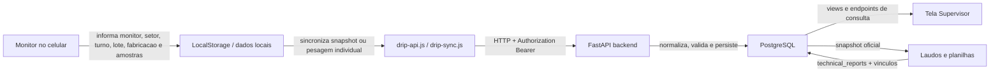
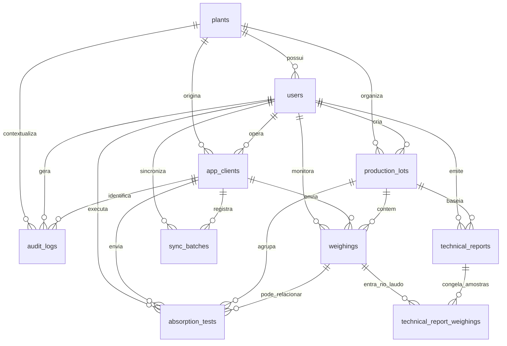
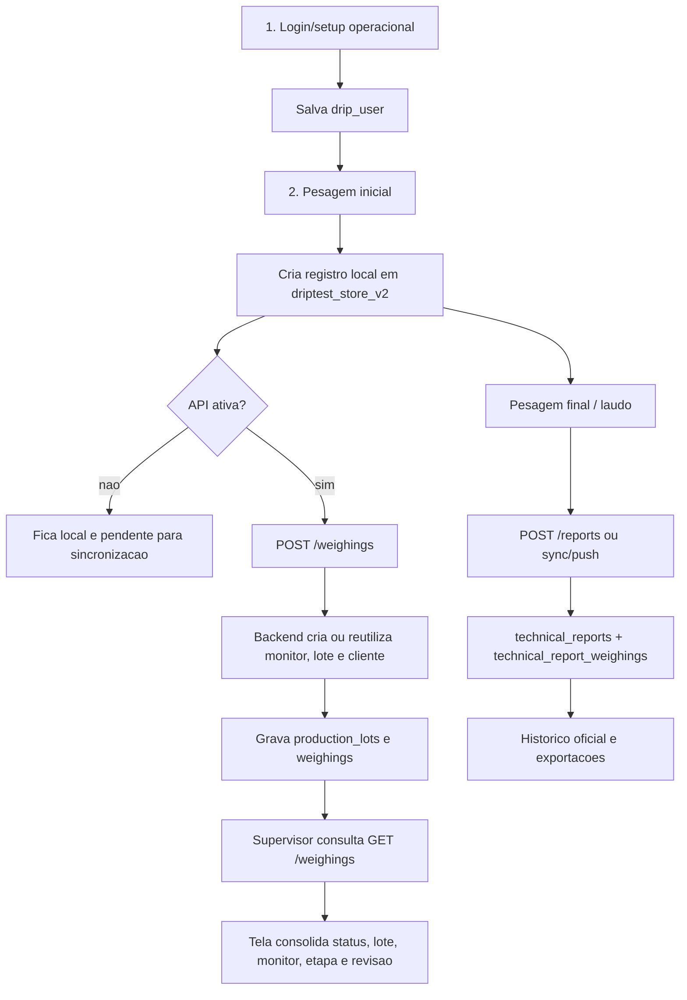
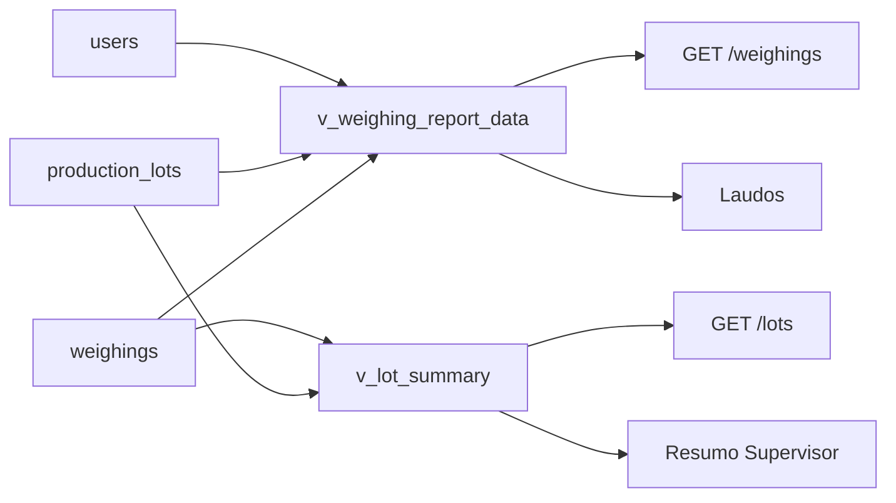

# Fluxograma e Modelo de Dados do DripTest

Este documento explica como a base de dados do DripTest esta modelada hoje, como os dados trafegam entre monitor, backend, banco e supervisor, e quais criterios precisam ser preservados nos proximos aprimoramentos.

## Visao Geral

O sistema usa uma arquitetura local-first: o monitor registra dados no app, o app pode salvar localmente, e quando a API esta configurada envia os dados para o backend FastAPI. O PostgreSQL passa a ser a fonte central para supervisao, laudos, auditoria e historico.

## Modelo Relacional

O modelo separa quatro responsabilidades principais:

- Identidade operacional: `plants`, `users`, `app_clients`.
- Processo produtivo: `production_lots`, `weighings`, `absorption_tests`.
- Documento oficial: `technical_reports`, `technical_report_weighings`.
- Rastreabilidade tecnica: `sync_batches`, `audit_logs`, views e indices.

## Fluxo do Monitor ate o Supervisor

## Papel das Tabelas

`plants`
Representa setor, planta ou unidade operacional. Hoje existe `Planta padrao`, mas a tabela ja prepara a separacao por setor real.

`users`
Guarda operadores, supervisores e administradores. O monitor pode ser criado automaticamente pelo backend quando a pesagem chega com `monitor_name`.

`app_clients`
Identifica o dispositivo/app que enviou dados. O `client_key` evita duplicidade e ajuda a rastrear origem de sincronizacao.

`production_lots`
E o lote tecnico de producao. A unicidade vem de `plant_id`, `lot_code`, `fabrication_date`, `product_brand` e `species`.

`weighings`
E a tabela central do processo DripTest. Guarda pesagem inicial, finalizacao, pesos, tempo, status e vinculos com lote, monitor e cliente.

`absorption_tests`
Guarda testes complementares de absorcao. Pode estar associado a uma pesagem especifica ou apenas ao lote.

`technical_reports`
Guarda o laudo oficial emitido pelo backend. Mantem totais estruturados e o `report_json` completo.

`technical_report_weighings`
Liga laudos a pesagens e preserva `snapshot_json`, ou seja, o estado da amostra no momento da emissao.

`sync_batches`
Registra pacotes de sincronizacao. Serve para diagnosticar falhas, conflitos e cargas enviadas pelo app.

`audit_logs`
Registra acoes relevantes do backend, com antes/depois quando aplicavel.

## Views de Leitura

`v_weighing_report_data`
Entrega uma linha enriquecida de pesagem para API, relatorios e supervisor, juntando pesagem, lote e monitor.

`v_lot_summary`
Agrega lotes com total de registros, finalizados, pendentes, pesos totais e media de perda.

## Criterios Importantes

Unicidade
O lote nao deve ser duplicado se tiver mesma planta, codigo, data de fabricacao, marca e especie. A amostra nao deve duplicar se vier com o mesmo `client_record_id`.

Rastreabilidade
Toda pesagem precisa carregar lote, monitor, origem do cliente e data/hora. Laudos precisam preservar snapshot das amostras para que uma mudanca posterior nao altere o historico emitido.

Idempotencia
Reenviar o mesmo registro do celular deve atualizar o registro existente, nao criar outra amostra igual. Esse criterio depende de `client_record_id` e `client_key`.

Supervisao
O supervisor precisa de dados descritivos e filtraveis: lote, setor/planta, monitor, turno, etapa, status, tempo, pendencia e origem local/API.

Offline-first
O app pode operar sem API, mas todo dado local sincronizado deve manter a mesma identidade quando chegar ao banco.

Auditoria
Acoes de criacao, finalizacao, reabertura e emissao de laudo devem ser rastreaveis por usuario, cliente, entidade e horario.

Consistencia de laudo
O laudo oficial deve sair do backend quando possivel, usando `technical_reports` e `technical_report_weighings`, para evitar divergencia entre PDF/local e historico central.

## Ponto de Atencao Atual

O frontend ja carrega `sectorName`/`plantName` no fluxo do monitor, mas a API ainda nao modela esse valor de forma completa no payload de pesagem. Na pratica, o backend ainda tende a usar `Planta padrao`.

Para melhorar a camada supervisor, o proximo ajuste recomendado e estruturar estes campos na API e no banco:

- `plant_name` ou `sector_name` no payload de `POST /weighings`.
- funcao `get_or_create_plant()` no backend.
- coluna `shift` propria em `weighings`.
- `plant_id`, `plant_name`, `shift`, `lot_id` e `notes` expostos em `v_weighing_report_data`.
- tela monitor exibindo contexto atual antes de registrar amostras.
- tela supervisor usando esses campos diretamente da API.

## Resumo da Alteracao

Foi criado um documento tecnico com fluxogramas Mermaid para explicar o modelo atual do banco, o caminho dos dados do monitor ate o supervisor, o papel de cada tabela, os criterios de consistencia e os pontos que precisam ser ajustados para melhorar a descricao operacional na camada supervisor.
